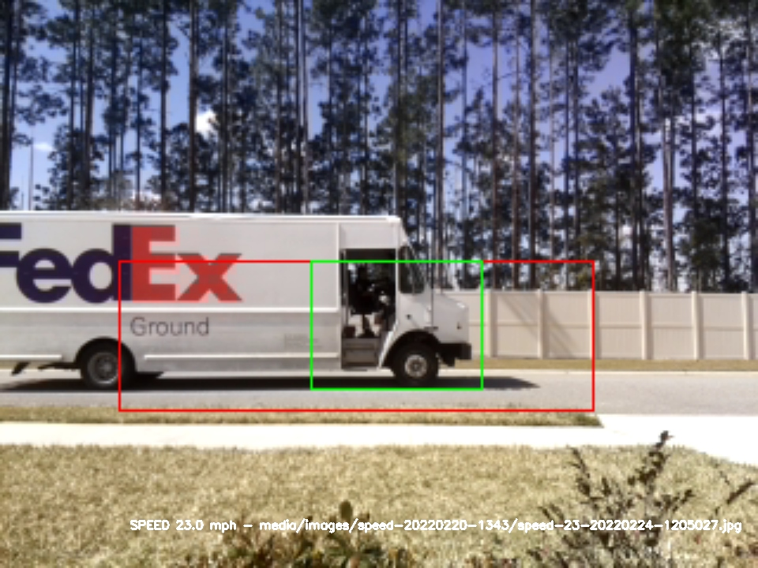
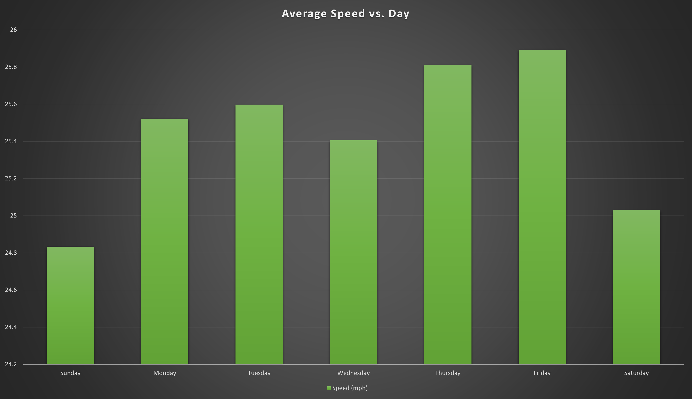
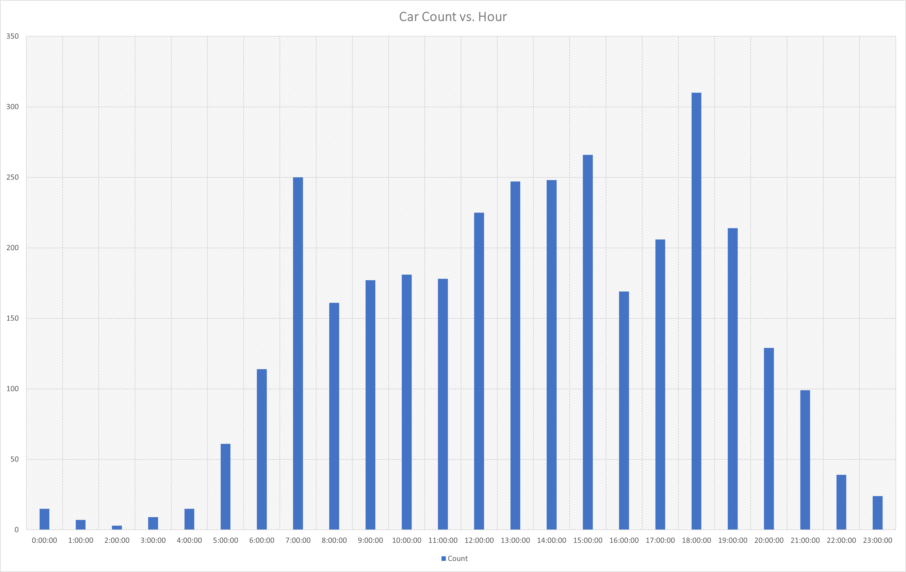
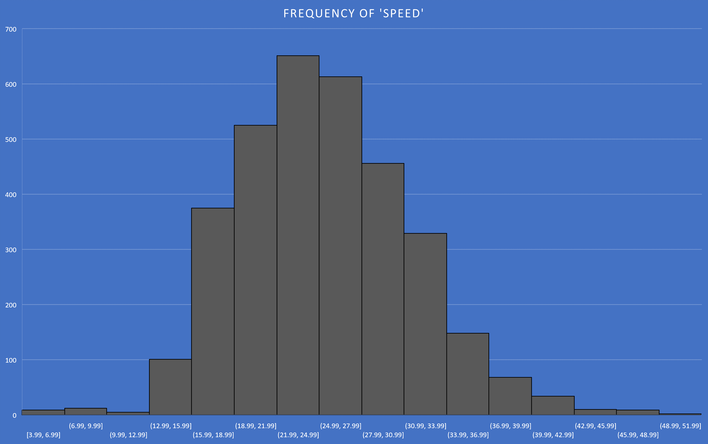
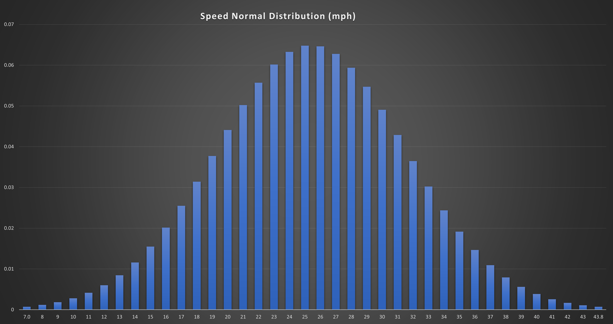
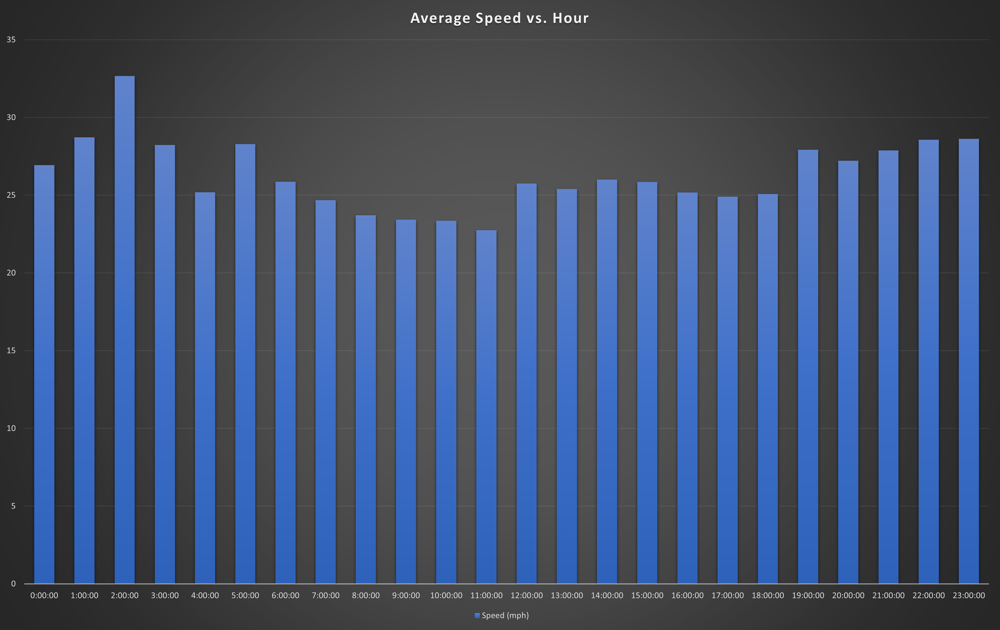
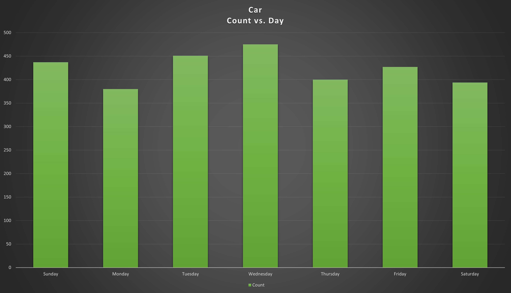

# Speed Camera

[](lib-release)
[](lib-release)
[](lib-stars)
[](lib-issues)
[](lib-licence)

## Purpose

- monitor the speed of people driving in front of my house :truck:
- take a picture of each car and label it with its speed :camera:
- make a cool time-lapse video and put it on youtube :tv: <https://youtu.be/GM9vSAUtNBc>
- make cool graphs to analyze the data :bar_chart: :chart_with_downwards_trend: (Charts/Graphs Below!)

## How

- Raspberry Pi Zero2 W
- Clone <https://github.com/pageauc/speed-camera.git> to the pi
- point the camera at the road
- add the starting of the scripts to the bottom of /etc/rc.local (above 'exit 0')
- calibrate and configure

## /etc/rc.local additions

```sh
cd /home/pi/speed-camera
python3 ./webserver.py &
python ./speed-cam.py &
```

## Example Image



## Charts / Graphs

### Average Speed vs. Day



### Car Count vs. Hour



### Frequency of Speed



### Speed's Normal Distribution



### Average Speed vs. Direction (L2R or R2L)

")

### Average Speed vs. Hour



### Car Count vs. Day


